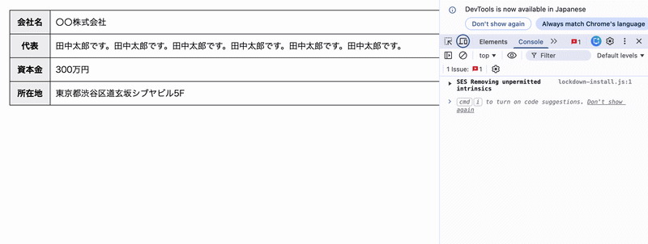

## Implementation_of_a_horizontally_scrollable_table
横スクロールができるテーブルを実装しました。
代表の名前が何回も出てくるのは、横スクロールを実装する長さをかせぎたかったからです。

## デモ
https://y-programing.github.io/Implementation_of_a_horizontally_scrollable_table/

## Preview

## 使用技術
・HTML
・CSS

## 機能
・横スクロール

## 制作目的
・フロントエンドの横スクロールを学習する目的で制作しました

## 実装ポイント
HTMLで表を作成し、CSSで

.table-wrap {
  overflow-x: scroll;
  display: block;
}

.table-wrap table th,
.table-wrap table td {
  white-space: nowrap;
}

を実装することで、横スクロールの表にしました。

また、メディアクエリで

@media screen and (max-width: 768px) {
  .table-wrap {
    overflow-x: auto;
  }

  table {
    width: 100%;
    table-layout: auto;
  }
  td {
    padding: 8px;
  }

  .table-wrap table th,
  .table-wrap table td {
    white-space: normal; 
    /* ↑ nowrapを解除 */
    padding: 8px;
  }
}

を実装することにより、タブレットやスマホで閲覧した場合にも
横幅が変化しながらもきちんと横スクロールが実装される様にしました。